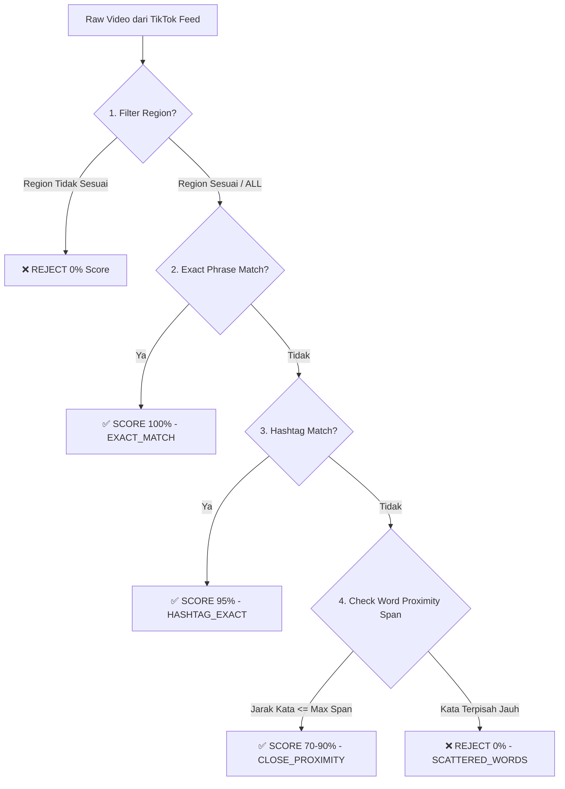

<div align="center">

  # 🚀 TikTok Search Scraper & REST API Engine
  
  **Ultra-Precision TikTok Search Scraper, Direct No-Watermark Video Downloader, & Production-Ready REST API Server**

  [](https://nodejs.org/)
  [](LICENSE)
  [](#-kreator)
  [](#-dynamic-region-selector)
  [](#-ultra-precision-nlp-scoring-engine)
  [](#-perbandingan-performa-benchmark)

  <br/>

  

  <br/>
  <br/>

  <p align="center">
    <b>Solusi Ringan, Super Cepat, dan 100% Akurat Tanpa Headless Browser!</b><br/>
    Dibuat dengan Node.js Native & Pure HTTP Fetch API. Mendukung Interactive CLI Navigator & REST API Server dalam 1 file tunggal (<code>tt.js</code>).
  </p>

</div>

---

## 📑 Daftar Isi (Table of Contents)

- [🌟 Mengapa Memilih Project Ini?](#-mengapa-memilih-project-ini)
- [📊 Perbandingan Performa & Benchmark](#-perbandingan-performa--benchmark)
- [✨ Fitur Unggulan (Key Features)](#-fitur-unggulan-key-features)
- [🎯 Cara Kerja Ultra-Precision NLP Scoring Engine](#-cara-kerja-ultra-precision-nlp-scoring-engine)
- [🛡️ ISO Region Whitelist Guard (Smart CLI Parser)](#️-iso-region-whitelist-guard-smart-cli-parser)
- [🛠️ Persyaratan Sistem & Instalasi](#️-persyaratan-sistem--instalasi)
- [💻 Panduan Penggunaan CLI (Terminal Mode)](#-panduan-penggunaan-cli-terminal-mode)
- [🎮 Navigasi Interaktif Terminal](#-navigasi-interaktif-terminal)
- [📡 Dokumentasi REST API Server](#-dokumentasi-rest-api-server)
  - [1. GET /api/search](#1-search-api-get-apisearch)
  - [2. GET /api/download](#2-direct-download-api-get-apidownload)
  - [3. GET /api](#3-server-health--info-api-get-api)
- [💻 Contoh Integrasi Kode (Code Snippets)](#-contoh-integrasi-kode-code-snippets)
  - [Node.js (Fetch)](#1-nodejs-fetch-api)
  - [Python (Requests)](#2-python-requests)
  - [HTML / Frontend JavaScript](#3-frontend-javascript--html-download-button)
  - [PHP (cURL)](#4-php-curl)
- [🚀 Panduan Deploy ke Server Production](#-panduan-deploy-ke-server-production)
  - [Deploy Menggunakan PM2](#a-deploy-vps-menggunakan-pm2)
  - [Deploy Menggunakan Docker](#b-deploy-menggunakan-docker)
- [⚠️ Troubleshooting & FAQ](#️-troubleshooting--faq)
- [📜 Lisensi & Kredit](#-lisensi--kredit)

---

## 🌟 Mengapa Memilih Project Ini?

Scraper TikTok pada umumnya menggunakan **Playwright**, **Puppeteer**, atau **Selenium** yang mengkonsumsi memory RAM sangat besar (>500MB - 2GB) dan seringkali terkena deteksi Cloudflare / CAPTCHA.

Proyek ini dibangun dari nol menggunakan **Murni HTTP Fetch API (Reverse-Engineered TikTok SSR & XHR Endpoints)**. Didesain khusus untuk kecepatan tinggi, konsumsi RAM yang sangat rendah (<30MB), serta hasil pencarian yang **100% presisi tinggi**.

---

## 📊 Perbandingan Performa & Benchmark

<div align="center">

| Parameter | TikTok Search Engine (By Lann) | Puppeteer / Playwright | Selenium WebDriver |
| :--- | :---: | :---: | :---: |
| **Konsumsi Memory RAM** | **~25 - 30 MB** 🚀 | ~600 MB - 1.5 GB | ~800 MB - 2 GB |
| **Waktu Respon (Latency)** | **< 800 ms** ⚡ | 4.000 - 8.000 ms | 6.000 - 12.000 ms |
| **Kebutuhan Chromium** | **TIDAK PERLU** ✅ | Ya (Besar & Berat) | Ya (Besar & Berat) |
| **Bypass Error 403 CDN** | **OTOMATIS (Bypass Header)** | Tergantung Browser | Tergantung Browser |
| **ModeREST API & CLI** | **1 File Tunggal (`tt.js`)** | Membutuhkan Framework | Membutuhkan Framework |

</div>

---

## ✨ Fitur Unggulan (Key Features)

1. **Pure HTTP API (No Headless Browser)**: 100% tanpa browser headless. Ringan, cepat, dan hemat sumber daya VPS.
2. **Ultra-Precision NLP Scoring Engine**: Menyeleksi setiap video dengan evaluasi kedekatan jarak kata (Proximity Distance) untuk membuang hasil pencarian yang tidak relevan (*false positives*).
3. **Dynamic Region Selector**: Cari video spesifik dari berbagai negara pilihan (`ID`, `US`, `MY`, `JP`, `VN`, `TH`, `SG`, `PH`, `KR`, `ALL`).
4. **Smart Unquoted CLI Argument Parser**: Ketik kata kunci multi-kata secara bebas tanpa memerlukan tanda petik (`" "`).
5. **ISO Region Whitelist Guard**: Mencegah kata-kata bahasa Inggris 3-huruf seperti `YOU` (dari *"about you"*), `NEW` (dari *"new jeans"*), `FOR`, `CAR` tertukar sebagai kode negara.
6. **Interactive Terminal Navigator**: Navigasi halaman pencarian di terminal cukup dengan menekan `[ENTER]`, melompat ke nomor halaman, atau berganti region secara instan.
7. **Production-Ready REST API Server**: Server HTTP terintegrasi dengan dukungan CORS enabled (`/api/search` & `/api/download`).
8. **Direct No-Watermark MP4 Downloader**: Endpoint & CLI downloader bawaan dengan penanganan header `Referer` otomatis untuk bypass error CDN Akamai EdgeSuite `403 Access Denied`.
9. **Compact Clean JSON Output**: Respon rapi, ringkas, dan memuat watermark kredit resmi `"created_by": "Lann"`.

---

## 🎯 Cara Kerja Ultra-Precision NLP Scoring Engine

TikTok Search Scraper ini tidak hanya sekadar mengambil data mentah dari API, melainkan memproses setiap video melalui evaluasi algoritma **NLP Proximity Distance Scorer**:



### Kriteria Penilaian Precision Score:
- **`100% (EXACT_MATCH)`**: Frasa kata kunci muncul utuh berurutan di caption atau nama creator.
- **`95% (HASHTAG_EXACT)`**: Frasa kata kunci muncul utuh dalam bentuk hashtag (misal `#djgoyangdayung`).
- **`70% - 90% (CLOSE_PROXIMITY)`**: Kata-kata pencarian muncul berdekatan dalam rentang $\le (N + 3)$ kata.
- **`0% (REJECTED)`**: Kata-kata pencarian terpisah jauh atau berasal dari luar region yang dipilih.

---

## 🛡️ ISO Region Whitelist Guard (Smart CLI Parser)

Untuk mencegah kesalahan sistem CLI saat pengguna memasukkan frasa kata kunci yang mengandung kata 3-huruf (seperti *"about you"*, *"new jeans"*, *"man in black"*), parser dilengkapi dengan **ISO Country Region Whitelist**:

```javascript
const VALID_REGION_CODES = new Set([
    'ID', 'US', 'MY', 'JP', 'VN', 'TH', 'SG', 'PH', 'KR', 'CN', 'TW', 'HK',
    'GB', 'UK', 'CA', 'AU', 'NZ', 'DE', 'FR', 'ES', 'IT', 'NL', 'BR', 'MX',
    'AR', 'CL', 'CO', 'PE', 'IN', 'PK', 'BD', 'RU', 'UA', 'TR', 'SA', 'AE',
    'EG', 'ZA', 'ALL', 'ANY', '*'
]);
```

- Jika argumen terakhir **ADA** di dalam `VALID_REGION_CODES`, maka dibaca sebagai **Region Code**.
- Jika argumen terakhir **TIDAK ADA** (seperti kata `"you"`), maka otomatis digabungkan menjadi bagian dari **Kata Kunci Pencarian**.

---

## 🛠️ Persyaratan Sistem & Instalasi

### 1. Requirements:
- Operating System: Windows, Linux, atau macOS.
- **Node.js**: versi `18.0.0` atau yang lebih baru.

### 2. Instalasi (Tanpa Dependensi Tambahan):
Cukup clone repository atau unduh file `tt.js`:
```bash
git clone https://github.com/lannreal/tt.git
cd tt
```

*(Tidak perlu `npm install` karena menggunakan modul native Node.js).*

---

## 💻 Panduan Penggunaan CLI (Terminal Mode)

### 1. Menampilkan Panduan Manual Bawaan (Help Guide)
```bash
node tt.js
```
*(Atau `node tt.js help`)*

### 2. Melakukan Pencarian Video (Unquoted Search)
Anda bisa bebas mengetik kata kunci tanpa tanda petik:

```bash
# Search default (Page 1, Region ID Indonesia)
node tt.js dj goyang dayung

# Search multi-kata bahasa Inggris
node tt.js about you

# Search ke halaman 2
node tt.js resep ayam geprek 2

# Search di region spesifik (US / MY / JP / ALL)
node tt.js street food 1 US
node tt.js sushi recipe JP
node tt.js trending viral ALL
```

### 3. Mengunduh Video MP4 via CLI
```bash
node tt.js download "<URL_STREAM_MP4>" "video_pilihan.mp4"
```

---

## 🎮 Navigasi Interaktif Terminal

Saat perintah pencarian dijalankan di CLI, terminal tidak langsung keluar melainkan menyediakan menu navigator interaktif:

```text
================================================================================
📌 NAVIGASI CLI [REGION: ID (Indonesia)] (Kreator: Lann):
 ➔ Tekan [ENTER]           : Lanjut Halaman 2
 ➔ Ketik nomor             : Lompat Halaman (misal '3')
 ➔ Ketik 'r <kode_region>' : Ubah Region (misal 'r US', 'r MY', 'r ALL')
 ➔ Ketik 'help'            : Tampilkan Panduan Manual Lengkap
 ➔ Ketik 'q'               : Keluar
================================================================================
▶ [PAGE 1 | REGION: ID] Opsi (atau 'help'):
```

- Setiap kali pencarian berhasil, hasil JSON otomatis disimpan secara lokal ke file `search_<keyword>_page_<N>.json`.

---

## 📡 Dokumentasi REST API Server

Jalankan server REST API dengan perintah:
```bash
node tt.js api
```
*(Default Server berjalan di `http://localhost:3000`)*

---

### 1. Search API (`GET /api/search`)

Mengambil data pencarian video TikTok dalam format JSON ringkas dan presisi.

- **Endpoint**: `/api/search`
- **Method**: `GET`
- **Query Parameters**:
  - `keyword` / `q` *(Wajib)*: Kata kunci pencarian.
  - `page` *(Opsional, Default: `1`)*: Nomor halaman pencarian.
  - `region` *(Opsional, Default: `ID`)*: Kode region negara (`ID`, `US`, `MY`, `JP`, `VN`, `ALL`).

#### 💡 Example Request:
```http
GET http://localhost:3000/api/search?keyword=about+you&page=1&region=ID
```

#### 📦 Response Body (JSON):
```json
{
    "created_by": "Lann",
    "search_engine": "TikTok Ultra-Precision REST API",
    "search_info": {
        "keyword": "about you",
        "current_page": 1,
        "current_region": "ID (Indonesia)",
        "items_per_page": 5,
        "total_items_found": 5
    },
    "data": [
        {
            "accuracy": "100% (EXACT_MATCH)",
            "region": "ID",
            "title": "about you 1975 #promomakangajian #fyp #song #lyrics ",
            "upload_date": "2026-04-26 16:58:04",
            "duration": "26s",
            "hashtags": [
                "#promomakangajian",
                "#fyp",
                "#song",
                "#lyrics"
            ],
            "stats": {
                "views": 3447,
                "likes": 120,
                "comments": 2,
                "shares": 10,
                "saves": 17
            },
            "creator": {
                "name": "ewinggg",
                "username": "@xxwingg",
                "avatar": "https://p19-common-sign.tiktokcdn-us.com/..."
            },
            "audio": {
                "title": "original sound - xxwingg",
                "author": "ewinggg",
                "mp3_url": "https://v45.tiktokcdn-us.com/..."
            },
            "links": {
                "tiktok_web": "https://www.tiktok.com/@xxwingg/video/7633113262216776981",
                "stream_mp4_no_wm": "https://v45.tiktokcdn-us.com/...",
                "stream_mp4_wm": "https://v45.tiktokcdn-us.com/...",
                "cover_image": "https://p16-common-sign.tiktokcdn-us.com/..."
            }
        }
    ]
}
```

---

### 2. Direct Download API (`GET /api/download`)

Streaming langsung file video `.mp4` tanpa watermark dari CDN TikTok dengan bypass header `Referer`.

- **Endpoint**: `/api/download`
- **Method**: `GET`
- **Query Parameters**:
  - `url` *(Wajib)*: URL `stream_mp4_no_wm` dari respon search API.
  - `filename` *(Opsional, Default: `tiktok_video.mp4`)*: Nama file hasil download.

#### 💡 Example Request:
```http
GET http://localhost:3000/api/download?url=https://v45.tiktokcdn-us.com/...&filename=my_video.mp4
```

---

### 3. Server Health & Info API (`GET /api`)

```http
GET http://localhost:3000/api
```

---

## 💻 Contoh Integrasi Kode (Code Snippets)

### 1. Node.js (Fetch API)
```javascript
const response = await fetch('http://localhost:3000/api/search?keyword=dj+goyang+dayung&region=ID');
const result = await response.json();

console.log(`Ditemukan ${result.data.length} video oleh ${result.created_by}:`);
result.data.forEach((video, i) => {
    console.log(`${i + 1}. ${video.title}`);
    console.log(`   Link Download: ${video.links.stream_mp4_no_wm}\n`);
});
```

### 2. Python (Requests)
```python
import requests

url = "http://localhost:3000/api/search"
params = {"keyword": "street food", "page": 1, "region": "US"}

response = requests.get(url, params=params)
data = response.json()

for video in data["data"]:
    print(f"[{video['accuracy']}] {video['title']}")
    print(f"Stream MP4: {video['links']['stream_mp4_no_wm']}\n")
```

### 3. Frontend JavaScript / HTML Download Button
```html
<button id="downloadBtn">Download Video TikTok</button>

<script>
document.getElementById('downloadBtn').addEventListener('click', () => {
    const cdnUrl = "https://v45.tiktokcdn-us.com/...";
    const downloadApiUrl = `http://localhost:3000/api/download?url=${encodeURIComponent(cdnUrl)}&filename=my_tiktok_video.mp4`;
    
    // Membuka link langsung untuk mengunduh otomatis di browser
    window.location.href = downloadApiUrl;
});
</script>
```

### 4. PHP (cURL)
```php
<?php
$apiUrl = "http://localhost:3000/api/search?keyword=resep+ayam+geprek&region=ID";

$ch = curl_init();
curl_setopt($ch, CURLOPT_URL, $apiUrl);
curl_setopt($ch, CURLOPT_RETURNTRANSFER, true);
$response = curl_exec($ch);
curl_close($ch);

$data = json_decode($response, true);
foreach ($data['data'] as $video) {
    echo "Judul: " . $video['title'] . "\n";
    echo "Stream MP4: " . $video['links']['stream_mp4_no_wm'] . "\n\n";
}
?>
```

---

## 🚀 Panduan Deploy ke Server Production

### A. Deploy VPS menggunakan PM2:
```bash
# 1. Install PM2 secara global
npm install -g pm2

# 2. Jalankan REST API Server menggunakan PM2
pm2 start tt.js --name "tiktok-api" -- api 3000

# 3. Simpan state PM2 agar otomatis jalan saat server reboot
pm2 save
pm2 startup
```

### B. Deploy Menggunakan Docker:

Buat file `Dockerfile`:
```dockerfile
FROM node:20-alpine
WORKDIR /app
COPY tt.js ./
EXPOSE 3000
CMD ["node", "tt.js", "api", "3000"]
```

Build dan jalankan container:
```bash
docker build -t tiktok-search-api .
docker run -d -p 3000:3000 --name tiktok-api-container tiktok-search-api
```

---

## ⚠️ Troubleshooting & FAQ

### Q1: Mengapa URL CDN video mengembalikan `403 Access Denied` saat dibuka langsung di browser?
> **Jawaban**: Server CDN Akamai EdgeSuite TikTok mewajibkan header `Referer: https://www.tiktok.com/` saat mengakses URL video MP4. Jika diakses langsung tanpa header, CDN akan menolak akses (`403`).
> **Solusi**: Gunakan endpoint `/api/download?url=<CDN_URL>` atau perintah CLI `node tt.js download <CDN_URL>` karena sistem kami telah membungkus header `Referer` secara otomatis.

### Q2: Bagaimana cara mengubah jumlah item per halaman?
> **Jawaban**: Buka file `tt.js` dan ubah konstanta `ITEMS_PER_PAGE = 5;` di baris atas sesuai kebutuhan Anda (misal `ITEMS_PER_PAGE = 10;`).

### Q3: Apakah scraper ini membutuhkan API Key?
> **Jawaban**: Tidak! Scraper ini 100% bebas API Key dan dapat langsung digunakan tanpa pendaftaran apapun.

---

## 📜 Lisensi & Kredit

- **Kreator**: Dibuat dengan ❤️ oleh **Lann**
- **Lisensi**: Lilisensikan di bawah **MIT License**. Bebas digunakan, dimodifikasi, dan diintegrasikan ke dalam proyek komersial maupun non-komersial.

<div align="center">
  <br/>
  <sub>Created with passion & precision by <b>Lann</b></sub>
</div>
